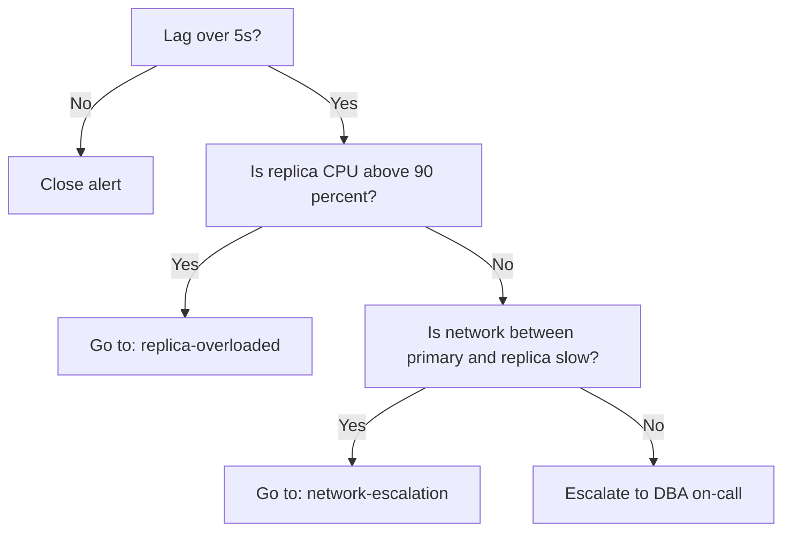

# Runbook: How to Write Runbooks

|  |  |
| --- | --- |
| **Owner** | SRE Team |
| **Last reviewed** | 2026-10-07 |
| **Applies to** | Every page in the GitLab wiki under `runbooks/` |
| **Audience** | Anyone who writes or edits a runbook |

## 1. Purpose

A runbook is a documented, repeatable procedure that lets a person complete an operational task or respond to an alert **without prior knowledge of the system**. This page defines how we write them so they stay small, correct, and usable at 3 AM by someone who has never seen the task before.

**The standard every runbook must meet (the 3 AM test):** hand it to an engineer who has never done this task, who is tired and stressed, and they finish it correctly without asking anyone a single question.

If a runbook fails that test, the runbook is the bug. Fix the runbook, not the person.

## 2. The Three Core Rules

1. **Keep pages small and arrange them in a hierarchy.** Broad topic at the top, narrower sub-pages beneath. Never let one page become a wall of text.
2. **Put all code in code blocks.** If a step involves typing, running, or editing anything, show the exact text in a fenced block that can be copy-pasted.
3. **Make it idiot-proof.** Assume zero context. State prerequisites, expected output, and what to do when things go wrong.

## 3. Rule 1: Hierarchy and Page Size

### 3.1 Size limits

| Limit | Value | If exceeded |
| --- | --- | --- |
| Steps in one procedure page | **10 max** | Split into sub-pages |
| Length of one page | **\~300 lines / about 3 screens** | Split into sub-pages |
| Hierarchy depth | **4 levels max** (Area > System > Topic > Procedure) | Reorganise |
| Decisions (if/else branches) in one page | **3 max** | Move each branch to its own page |

These are triggers to split, not suggestions. If you find yourself scrolling to find the next step, split the page.

### 3.2 The four page types

Every page is exactly one of these types. Do not mix them.

| Type | Purpose | Contains | Example |
| --- | --- | --- | --- |
| **Index (hub)** | Navigation only | Short description + links to children. No procedures. | `runbooks/databases/postgres` |
| **Procedure** | Do a task (planned work) | Numbered steps with code | `.../postgres/add-read-replica` |
| **Alert response** | Respond to a specific alert | Triage > diagnose > fix > escalate | `.../postgres/alert-replication-lag-high` |
| **Reference** | Facts you look up | Tables, ports, endpoints, glossary. No steps. | `.../postgres/reference-cluster-inventory` |

### 3.3 Example tree

```text
runbooks/                                  <- Home: lists every area
├── databases/                             <- Index
│   ├── postgres/                          <- Index
│   │   ├── add-read-replica               <- Procedure
│   │   ├── failover-primary               <- Procedure
│   │   ├── alert-replication-lag-high     <- Alert response
│   │   ├── alert-disk-above-85-percent    <- Alert response
│   │   └── reference-cluster-inventory    <- Reference
│   └── redis/
├── kubernetes/
│   ├── node-drain-and-replace
│   └── alert-pod-crashloop
├── networking/
└── meta/
    └── how-to-write-runbooks              <- This page
```

### 3.4 Rules for splitting

- If a step needs more than \~5 lines of explanation, it becomes its own page and the parent links to it.
- If two runbooks share the same sub-procedure (for example, 'log in to the bastion'), write it **once** as its own page and link to it from both. Never copy and paste content between runbooks; the copies will drift.
- Every index page lists its children with a one-line description of when to use each.
- Every page links **up** to its parent and lists related pages at the bottom.
- Name pages with lowercase words and hyphens, starting with a verb for procedures (`add-read-replica`) or `alert-` for alert responses. Names must make sense in a search result without context.

### 3.5 Index page template

```markdown
# Postgres

Runbooks for operating our PostgreSQL clusters.

[[_TOC_]]

## Planned work
- [Add a read replica](add-read-replica): use when read traffic needs more capacity.
- [Fail over the primary](failover-primary): use for planned maintenance on the primary.

## Alerts
- [Replication lag high](alert-replication-lag-high)
- [Disk above 85 percent](alert-disk-above-85-percent)

## Reference
- [Cluster inventory](reference-cluster-inventory)

Parent: [Databases](../databases)
```

## 4. Rule 2: Code Goes in Code Blocks

### 4.1 Rules

1. **Every command, query, config snippet, and file path is in a fenced code block** with a language tag (`bash`, `sql`, `yaml`, `json`, `text`).
2. **One action per block.** Do not chain unrelated commands in a single block. The reader runs a block, checks the result, then continues.
3. **Blocks must be copy-pasteable as written.** No ` $  ` prompt prefix, no line numbers, no smart quotes.
4. **Show expected output** in a separate `text` block after each command that produces output.
5. **Use variables for anything the reader must change**, defined once at the top of the procedure. Never make the reader hunt through a command to find the thing to edit.
6. **Prefer read-only commands first.** Look before you change.
7. **Make commands safe to re-run (idempotent) where possible**, and say so. Where they are not, say so loudly.
8. **Never put secrets in a runbook.** Show where to fetch them (for example, 'from Vault path `secret/prod/db`') and use environment variables.

### 4.2 Bad vs. good

**Bad:**

> SSH to the db host and check replication, then restart the service if it looks bad.

This fails the test: which host? What does 'bad' look like? Restart which service? How?

**Good:**

> **Step 3: Check replication state on the replica**
>
> Set these once for the whole procedure:
>
> ```bash
> export REPLICA_HOST=pg-replica-01.prod.example.com
> ```
>
> Log in:
>
> ```bash
> ssh "$REPLICA_HOST"
> ```
>
> Check lag:
>
> ```bash
> sudo -u postgres psql -c 'SELECT now() - pg_last_xact_replay_timestamp() AS lag;'
> ```
>
> **Expected output (healthy):** lag under 5 seconds.
>
> ```text
>        lag
> -----------------
>  00:00:00.412
> ```
>
> - Lag under 5 seconds: stop here. Nothing is wrong. Go to **Step 7: Close out**.
> - Lag over 5 seconds: continue to **Step 4**.
> - Command errors or hangs: go to **Escalation**.

## 5. Rule 3: Idiot-Proof Means Zero Assumed Context

'Idiot-proof' does not mean the reader is stupid. It means **we do not make them use knowledge we have not given them.** Check every runbook against this list.

### 5.1 The idiot-proof checklist

- [ ] **Goal, when to use, when NOT to use:** one sentence each, with a link to the right runbook for the 'not' cases.
- [ ] **Prerequisites:** each says how to verify it and what to do if it is missing (access, tools, permissions, approvals).
- [ ] **One action per numbered step**, using exact hostnames, paths, and URLs. No 'the database server'.
- [ ] **Every command shows expected output** and says what to do on success, error, or hang.
- [ ] **Dangerous steps** carry a warning, the blast radius, and how to undo.
- [ ] **Verification, rollback, escalation, and time estimate** are all present.
- [ ] **Acronyms and internal names** are defined or linked on first use, and links go to the exact page.
- [ ] **Someone other than the author** has run it successfully (see 7.2).

### 5.2 Writing style rules

1. **Imperative, short sentences:** 'Run the command', one idea each.
2. **No 'obviously', 'simply', 'just', or 'as usual'.** If it were obvious, it would not need a runbook.
3. **Warning before the dangerous step**, never after.
4. **Say what the reader should see before they act**, so they can confirm they are in the right place.
5. **Screenshots only for UI steps**, always with alt text and a text description.
6. **Skimmable:** decision first in each step, key action in bold.

**Warning format (rule 3).** Use GitLab's alert blockquotes so warnings stand out:

```markdown
> [!warning]
> This step restarts the primary and drops all connections for about 30 seconds.
> Do not run during business hours. To undo: see Rollback, step R2.
```

## 6. Standard Templates

Copy the appropriate template, delete the guidance in italics, and fill in every section. If a section does not apply, write 'Not applicable' and why. Do not delete the heading.

### 6.1 Procedure runbook template

````markdown
# <Verb> <Thing>

| | |
|---|---|
| **Owner** | <team or person, with Slack channel> |
| **Last reviewed** | YYYY-MM-DD |
| **Last tested** | YYYY-MM-DD by <name> |
| **Estimated time** | <e.g. 20 minutes> |
| **Risk level** | Low / Medium / High |
| **Parent** | [<Parent page>](../parent) |

[[_TOC_]]

## Goal
_One sentence: what is true when this is finished._

## When to use this
_Concrete triggers._

## When NOT to use this
_Situations where this is the wrong runbook, with a link to the right one._

## Prerequisites
_Everything needed before step 1. For each, say how to check it and what to do if it is missing._

| Requirement | How to verify | If missing |
|---|---|---|
| Access to <system> | `<command>` | Request access: <link> |
| Tool <x>, version <y> | `<command>` | Install: <link> |
| Approval from <who>, if required | Link to the approval ticket | Ask <who> in <channel> |

## Variables
_Everything the reader must fill in, defined once._

```bash
export ENVIRONMENT=prod
export TARGET_HOST=<fill in>
```

## Procedure

### Step 1: <Single action>
_Why this matters (one line)._

```bash
<command>
```

**Expected output:**

```text
<output>
```

- If you see the above: continue to Step 2.
- If you see <error>: <what to do>.

### Step 2: ...

## Verification
_How to prove it worked, with commands and expected output._

## Rollback
_How to undo each step, in reverse order._

## Troubleshooting
| Symptom | Likely cause | Fix |
|---|---|---|
| | | |

## Escalation
_Who to contact, how (page, Slack, phone), and after how many minutes of being stuck._

## Related pages
- <links>

## Change history
_Not needed: the wiki git history is the change history._
````

### 6.2 Alert response runbook template

Alert runbooks are read under pressure, so they are optimised for speed. **The first screen must tell the reader how bad it is and what to do first.**

```markdown
# Alert: <Exact alert name>

| | |
|---|---|
| **Alert name** | `<name exactly as it appears in alertmanager>` |
| **Severity** | Page / Ticket |
| **Owner** | <team> |
| **Last reviewed** | YYYY-MM-DD |
| **Last tested** | YYYY-MM-DD |

## 30-second summary
- **What it means:** <plain English>
- **Customer impact:** <what users experience, or 'none yet'>
- **First action:** <the single most useful thing to do now>

## Is it real? (Triage)
_Commands/dashboards to confirm the alert is not a false positive. Link the dashboard._

## Diagnose
_A decision tree: symptom, command, interpretation, next step._

## Fix
_One section per known cause, each linking to a procedure page if long._

## Verify resolved
_What must be true before closing the alert._

## Escalate
_Who and when._

## Background (optional, below the fold)
_Architecture notes, history, past incidents._
```

### 6.3 Diagnose sections: use decision flows

For branching diagnosis, use a Mermaid diagram. GitLab wiki renders Mermaid natively:

````markdown

````

Always add the text version of the flow below the diagram, because diagrams are hard to skim and not accessible to everyone.

## 7. Lifecycle: Writing, Testing, Reviewing, Retiring

### 7.1 Creating a runbook

1. **Decide the page type** (index, procedure, alert, reference).
2. **Find its place in the tree.** Look at the parent index page. If it does not fit anywhere, discuss in the SRE channel before creating a new top-level area.
3. **Create the page** in the GitLab wiki with the full path as the title, for example `runbooks/databases/postgres/add-read-replica`. A slash in a GitLab wiki page title creates the hierarchy.
4. **Copy the matching template** from section 6 and fill it in.
5. **Do the task yourself while writing.** Write each step as you perform it, copying real commands and real output. Never write a runbook from memory.
6. **Link it** from the parent index page, and from the alert definition if it is an alert runbook.
7. **Have someone else test it** (next section) before you call it done.

### 7.2 Testing a runbook

A runbook that has not been executed by someone else is a hypothesis, not documentation.

- **Cold-read test:** give it to a teammate who has never done the task. They execute it in a non-production environment while you **watch silently and take notes**. Every time they hesitate, ask a question, or deviate, that is a defect in the runbook. Fix it, then repeat with another person if the defects were large.
- **Wheel of Misfortune:** (as practiced at Google and others) run on-call role-play sessions where someone follows alert runbooks against a simulated incident. Do this at least quarterly.
- **Game days / chaos experiments:** deliberately cause the failure in staging (or production, once mature) and respond using only the runbook.
- **Record the result** by updating the `Last tested` line.

### 7.3 Keeping runbooks up to date

Stale documentation is worse than no documentation, because people trust it.

| Trigger | Action | Who |
| --- | --- | --- |
| Every incident | Postmortem has a mandatory action item: 'Which runbooks were used or missing? Update them.' | Incident commander |
| Every on-call handoff | Outgoing engineer lists runbooks that were wrong, confusing, or missing | On-call |
| Every change to a system | The change request/MR checklist includes 'Runbooks updated?' | Change author |
| Every 6 months (high-risk runbooks: 3 months) | Owner re-reads and re-tests, updates `Last reviewed` | Page owner |
| Anyone finds an error | **Fix it immediately.** Do not file a ticket for a typo. Edit the wiki. | Anyone |

A culture rule: **if you follow a runbook and something is wrong, you are responsible for fixing it before you close the task.** Leaving the wiki wrong is leaving the production system wrong.

### 7.4 Ownership

- Every page names an **owning team** (not just a person, because people leave).
- Orphaned pages (owner no longer exists) are assigned or deleted in the quarterly review.
- Ownership is shown in the metadata table at the top.

### 7.5 Retiring a runbook

Do not leave dead pages around. When a system is decommissioned:

1. Remove the link from the parent index and from any alert annotations.
2. Delete the page (git history keeps it).
3. Check for inbound links:

```bash
git clone git@gitlab.example.com:your-group/your-project.wiki.git
cd your-project.wiki
grep -rn 'add-read-replica' .
```

## 8. GitLab Wiki Specifics

### 8.1 How the wiki works

- Each project's wiki is a **git repository** (`<project>.wiki.git`) containing Markdown files. You can edit in the web UI or clone it and work locally with your normal tools.
- A page title with slashes (for example `runbooks/databases/postgres/failover-primary`) creates nested directories and a hierarchy in the sidebar.
- Pages use GitLab Flavored Markdown, which supports tables, task lists, Mermaid diagrams, alert blockquotes, and `[[_TOC_]]` for an automatic table of contents.
- Use relative links between pages so links survive renames of the project or group.
- Use the wiki's built-in page templates feature if your GitLab version has it, and load the templates from section 6 into it.

### 8.2 Working locally (recommended for big edits and for reviews)

```bash
git clone git@gitlab.example.com:your-group/your-project.wiki.git
cd your-project.wiki
```

Find pages that exceed the size limit:

```bash
find . -name '*.md' -not -path './.git/*' -exec wc -l {} + | sort -rn | awk '$1 > 300'
```

Search for a command or hostname that changed:

```bash
grep -rn 'pg-replica-01' --include='*.md' .
```

Commit and push:

```bash
git add -A
git commit -m 'runbooks/postgres: update failover steps after INC-1234'
git push
```

Reference the incident or ticket ID in the commit message so the reason for the change is traceable.

### 8.3 Limits of the wiki (know them)

- Wiki repositories do not go through merge requests by default. If you want peer review, agree a team rule: **high-risk runbooks are edited via a clone and reviewed by a second person before pushing**, or consider a separate docs repo with MR approvals that publishes to the wiki.
- Search covers titles and content but is basic. Naming consistency matters more than usual.
- There is no built-in 'stale page' reporting, so we create it ourselves (next section).

### 8.4 Automated runbook linting

Schedule this from a GitLab CI pipeline (for example, a weekly scheduled pipeline in an SRE tools project that clones the wiki). It enforces the standard so we do not rely on willpower.

````python
#!/usr/bin/env python3
"""Lint a GitLab wiki checkout against the runbook standard.

Usage: ./lint_runbooks.py /path/to/project.wiki
Exit code 1 if any problem is found.
"""
import re
import sys
from datetime import date, datetime
from pathlib import Path

MAX_LINES = 300
MAX_AGE_DAYS = 180
REQUIRED_HEADINGS = ['Goal', 'Prerequisites', 'Verification', 'Rollback', 'Escalation']

root = Path(sys.argv[1])
problems = []

for page in root.rglob('*.md'):
    if '.git' in page.parts or page.name.startswith('_'):
        continue
    rel = page.relative_to(root)
    text = page.read_text(encoding='utf-8')
    lines = text.splitlines()

    if len(lines) > MAX_LINES:
        problems.append(f'{rel}: {len(lines)} lines, over {MAX_LINES}; split this page')

    m = re.search(r'Last reviewed\*\*\s*\|\s*(\d{4}-\d{2}-\d{2})', text)
    if not m:
        problems.append(f'{rel}: missing Last reviewed date')
    else:
        age = (date.today() - datetime.strptime(m.group(1), '%Y-%m-%d').date()).days
        if age > MAX_AGE_DAYS:
            problems.append(f'{rel}: last reviewed {age} days ago')

    if 'Owner' not in text:
        problems.append(f'{rel}: missing Owner')

    # Procedure and alert pages need the safety sections. Index/reference pages are exempt.
    is_exempt = rel.name.startswith('reference-') or rel.stem == rel.parent.name or 'index' in rel.name
    if not is_exempt and not text.lstrip().startswith('# Alert:'):
        for h in REQUIRED_HEADINGS:
            if not re.search(rf'^##\s+{h}', text, re.M):
                problems.append(f'{rel}: missing section ## {h}')

    # Any line that looks like a shell command but sits outside a code fence.
    in_fence = False
    for n, line in enumerate(lines, 1):
        if line.strip().startswith('```'):
            in_fence = not in_fence
        elif not in_fence and re.match(r'^\s*(\$ |sudo |kubectl |ssh |psql |curl )', line):
            problems.append(f'{rel}:{n}: command outside code block')

for p in problems:
    print(p)
print(f'{len(problems)} problem(s) found')
sys.exit(1 if problems else 0)
````

Example GitLab CI job:

```yaml
lint-runbooks:
  image: python:3.12-slim
  rules:
    - if: $CI_PIPELINE_SOURCE == 'schedule'
  script:
    - git clone https://oauth2:${WIKI_READ_TOKEN}@${CI_SERVER_HOST}/your-group/your-project.wiki.git wiki
    - python lint_runbooks.py wiki
```

Pipeline failures notify the team channel, giving us a weekly list of pages that need attention.

## 9. Quick Reference

| I want to... | Do this |
| --- | --- |
| Write a new runbook | Section 7.1, then template in section 6 |
| Know if my page is too big | Over 10 steps or 300 lines: split (section 3) |
| Make my steps idiot-proof | Checklist in section 5.1 |
| Test my runbook | Cold-read test, section 7.2 |
| Fix something wrong I found | Edit it right now, update `Last reviewed` |
| Check the wiki for stale pages | Lint script, section 8.4 |

## Related pages 
- **Suggestions**!
    - Runbooks Home
    - On-call handbook
    - Incident response playbook
    - Postmortem template
